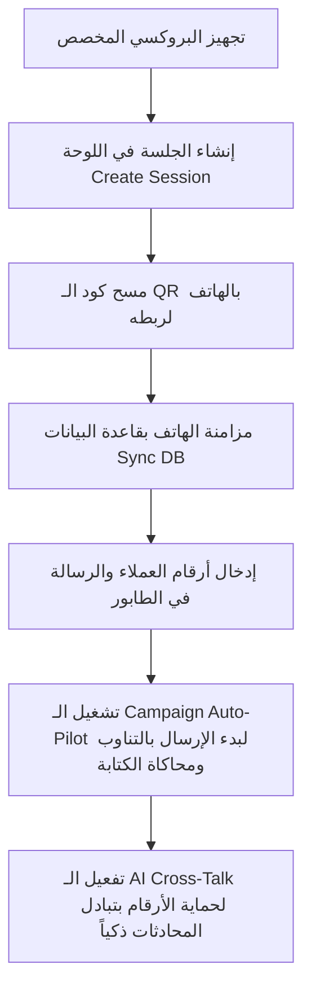

# الدليل الذهبي الشامل والكامل لنظام WAHA Control Room 🏆📖

هذا الدليل هو المرجع الرئيسي الموحد للمشروع. يشرح بالتفصيل الممل كل أداة وتقنية مستخدمة في هذا النظام، ما هي فائدتها، كيف تعمل، هل يمكن الاستغناء عنها، وكيفية إعداد كل جزء (بما في ذلك البروكسي والتشغيل على السيرفر).

---

## 🛠️ الباب الأول: تشريح وتقنيات النظام (كل أداة وفائدتها واستخدامها)

### 1. إطار عمل الموقع (Next.js & React)
* **ما هي الفائدة؟**
  هو المحرك البرمجي الذي يبني لوحة التحكم (الموقع). يربط الواجهة الأمامية (التي تراها بالعين وتتفاعل معها كأزرار وجداول) بالخلفية (التي تتصل بقاعدة البيانات وتخاطب محرك WAHA).
* **كيفية الاستخدام؟**
  هو كود المشروع الحالي المكتوب بلغة TypeScript و React.
* **هل يمكن الاستغناء عنه؟**
  **لا يمكن الاستغناء عنه لإدارة النظام.** بدونه ستضطر للتحكم في الحملات عن طريق كتابة أكواد برمجية معقدة لكل رسالة أو سطر في قاعدة البيانات يدوياً.

### 2. محرك الواتساب (WAHA Engine & Docker)
* **ما هي الفائدة؟**
  هو النواة الحقيقية للنظام. يقوم بتشغيل متصفح Chrome افتراضي ومخفي خلف الكواليس لكل هاتف تقوم بربطه. يقوم بتحويل الأوامر البرمجية البسيطة التي ترسلها اللوحة إلى نقرات حقيقية داخل تطبيق واتساب ويب.
* **كيفية الاستخدام؟**
  يعمل داخل حاوية **Docker** لضمان استقراره وعزله عن بقية ملفات السيرفر.
* **هل يمكن الاستغناء عنه؟**
  **لا، مستحيل الاستغناء عنه.** هو حلقة الوصل الوحيدة بين سيرفرك وبين شبكة واتساب الرسمية.

### 3. قاعدة البيانات ومحرك الربط (Prisma ORM & SQLite/Supabase)
* **ما هي الفائدة؟**
  * **قاعدة البيانات (SQLite محلياً أو Supabase في الإنتاج):** تقوم بحفظ طوابير الرسائل، وحالة كل رسالة (Sent أو Failed)، وبيانات الهواتف النشطة والبروكسيات لضمان عدم ضياع البيانات عند إيقاف التشغيل.
  * **Prisma (مترجم قاعدة البيانات):** هو الأداة التي تسهل على كود Next.js قراءة وحفظ البيانات من وإلى قاعدة البيانات دون كتابة أوامر SQL معقدة وطويلة.
* **كيفية الاستخدام؟**
  يتم تهيئتها عبر ملف `prisma/schema.prisma` وتحديثها بأمر `npx prisma db push`.
* **هل يمكن الاستغناء عنهما؟**
  **لا يمكن الاستغناء عن قاعدة البيانات.** بدونها، لن يستطيع النظام تذكر الهواتف المرتبطة، أو معرفة أي الرسائل تم إرسالها وأيها فشل عند انقطاع الكهرباء أو عمل ريستارت للسيرفر.

### 4. البروكسي (Proxy) - بالتفصيل الممل
* **ما هي الفائدة؟**
  يمنع كشف الهوية الشبكية للأرقام. بدون بروكسي، ستتصل جميع هواتفك (مثلاً 5 هواتف) بنفس عنوان IP الخاص بالسيرفر. خوارزميات واتساب للأمان ستكشف فوراً أن هذا الـ IP يرسل مئات الرسائل بشكل مؤتمت وتجاري وتقوم بحظر الأرقام الخمسة دفعة واحدة. البروكسي يعطي كل هاتف عنوان IP فريد وجغرافي مختلف كأنهم أشخاص حقيقيون منفصلون.
* **الأنواع المناسبة للواتساب:**
  1. **بروكسيات الموبايل (4G/5G Proxies) - [الخيار الذهبي والأقوى]:** عناوين IP قادمة من شبكات اتصالات حقيقية (SIM Cards). يثق فيها واتساب ثقة عمياء لأن حظر هذا الـ IP يضر بآلاف المستخدمين الأبرياء المشتركين في نفس البرج، لذلك يتفادى واتساب حظرها.
  2. **البروكسيات السكنية (Residential Proxies):** عناوين إنترنت منزلي حقيقية (WE, STC, Vodafone) وتعتبر ممتازة جداً وموثوقة.
  3. **بروكسيات مراكز البيانات (Datacenter Proxies):** عناوين سيرفرات (AWS, Hetzner) - **[ممنوعة تماماً]** لأن واتساب يكتشفها ويحظر الرقم فوراً.
* **كيف تحصل عليه؟**
  * **الشراء:** من مواقع مثل AstroProxy أو Webshare أو Proxy-Seller.
  * **الصناعة المجانية:** يمكنك تحويل أي هاتف أندرويد متصل بـ 4G وباقة إنترنت إلى بروكسي مخصص مجاناً عبر تنزيل تطبيق مثل **Every Proxy** وتمرير البورت عبر خدمة **Ngrok** أو **Tailscale** للحصول على رابط خارجي.
* **طريقة الكتابة:**
  يُكتب البروكسي بالصيغة القياسية: `http://user:pass@ip:port` في حقل البروكسي عند إنشاء الجلسة.
* **هل يمكن الاستغناء عنه؟**
  **ممكن تقنياً، ولكن عواقبه الحظر الفوري والسريع لأرقامك.**

### 5. الذكاء الاصطناعي ورعاية الأرقام (Gemini AI & AI Cross-Talk)
* **ما هي الفائدة؟**
  تقوم خوارزميات واتساب بمراقبة الحسابات التي ترسل فقط رسائل إعلانية في اتجاه واحد دون تلقي أي ردود، وتصنفها كـ "سبام" وتقوم بحظرها. لحل هذه المشكلة، يقوم نظام الـ **AI Cross-Talk** باستخدام ذكاء اصطناعي (Gemini) لفتح دردشات تفاعلية وذكية بين هواتفك النشطة وبعضها البعض في الخلفية. هذا يرفع "تقييم الثقة" (Trust Score) للأرقام ويحميها من البان.
* **كيفية الاستخدام؟**
  ببساطة قم بتفعيل زر **AI Cross-Talk Auto-Pilot** على واجهة الموقع.
* **هل يمكن الاستغناء عنها؟**
  **ممكن، ولكن يعرض الأرقام للحظر السريع جداً** عند بدء الحملات المكثفة.

### 6. شبكة الحماية الخاصة (Tailscale VPN)
* **ما هي الفائدة؟**
  بدلاً من فتح بورتات لوحة التحكم ومحرك WAHA للعامة على الإنترنت (مما يعرض السيرفر للاختراق أو الكشف الشبكي لأرقامك من أطراف خارجية)، تقوم **Tailscale** بإنشاء شبكة VPN خاصة ومغلقة بين جهازك والسيرفر.
* **كيفية الاستخدام؟**
  يتم تثبيتها على السيرفر وجهازك الشخصي وتفتح الموقع عبر الآي بي المؤمن الخاص بالشبكة (مثال: `http://100.x.y.z:3001`).
* **هل يمكن الاستغناء عنها؟**
  **ممكن.** يمكنك استبدالها بربط دومين عام مع شهادة SSL عامة (Nginx)، ولكن خيار Tailscale يوفر أماناً وحماية مطلقة وبدون تكاليف أو تعقيدات.

---

## 🔄 الباب الثاني: دورة وسير العمل خطوة بخطوة (The Workflow)



### الخطوات العملية للتشغيل اليومي:
1. **التهيئة:** افتح تبويب **Devices & Proxies** وأدخل اسم الجلسة والبروكسي المخصص لها ثم اضغط **Create Session**.
2. **الربط:** اضغط **Scan QR** للجلسة المنشأة، وافتح هاتفك وامسح الرمز ضوئياً لربطه بواتساب ويب.
3. **التسجيل:** اضغط زر **Sync DB** لتسجيل الهاتف في جدول المرسلين النشطين.
4. **تجهيز الحملة:** في تبويب **Campaigns & AI**، أدخل اسم الحملة، أرقام العملاء، ونص الرسالة (يفضل استخدام الـ Spintax مثل `{أهلاً|مرحباً}`) واضغط **Add to Queue**.
5. **الإرسال التلقائي:** فعل زر **Campaign Auto-Pilot** ليبدأ النظام بإرسال الرسائل ومحاكاة حركة الكتابة البشرية (Typing...).
6. **الرعاية والوقاية:** فعل زر **AI Cross-Talk Auto-Pilot** لتبدأ الهواتف بالدردشة التلقائية بالذكاء الاصطناعي لرفع تقييم الحسابات وتفادي الحظر.

---

## 🚀 الباب الثالث: خطة النشر والتشغيل على سيرفر VPS (بإيجاز)

عند نقل المشروع إلى سيرفر VPS يعمل بنظام **Ubuntu**:

1. **تثبيت البرامج الأساسية:**
   ```bash
   sudo apt update && sudo apt install docker.io docker-compose nodejs npm -y
   sudo npm install pm2 -g
   ```
2. **تشغيل محرك WAHA (بورت 3000):**
   تجهيز ملف `docker-compose.yml` وتشغيله بـ `docker-compose up -d`.
3. **تشغيل لوحة التحكم Next.js (بورت 3001):**
   سحب الكود وتثبيت الحزم بـ `npm install` ومزامنة الجداول بـ `npx prisma db push` وبناء المشروع بـ `npm run build` وتشغيله بـ PM2:
   ```bash
   pm2 start npm --name "waha-proxy" -- run start -- -p 3001
   ```
4. **التأمين (Tailscale):**
   تثبيت Tailscale على السيرفر وجهازك لتصفح لوحة التحكم بأمان كامل عبر رابط الـ VPN المخصص: `http://100.x.y.z:3001`.

---

## 💡 الباب الرابع: نصائح ذهبية لحماية أرقام الواتساب من الحظر
* **تدفئة الحسابات (Warm-up):** لا تستخدم رقماً جديداً تماماً لإرسال 500 رسالة دفعة واحدة. ابدأ بـ 20 رسالة يومياً، وزدها تدريجياً على مدار أسبوعين.
* **تفعيل المحادثة البينية:** اترك الأرقام تدردش مع بعضها عبر الـ AI Cross-Talk لمدة نصف ساعة على الأقل قبل إطلاق أي حملة.
* **التنويع النصي:** لا ترسل نفس النص لجميع العملاء. استخدم الـ Spintax دائماً لضمان اختلاف الرسائل وتجنب رصدها كبوتات.
* **احترام أوقات العملاء:** لا ترسل رسائل إعلانية مكثفة في أوقات متأخرة من الليل لتجنب قيام العملاء بحظرك يدوياً (Report & Block)، لأن البلاغات اليدوية هي أسرع طريق لحظر الرقم.
