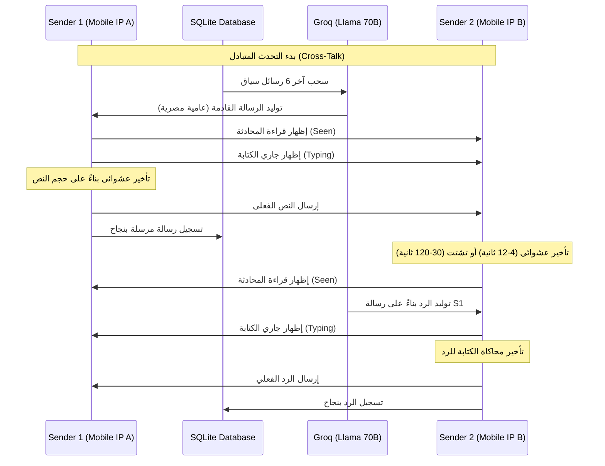
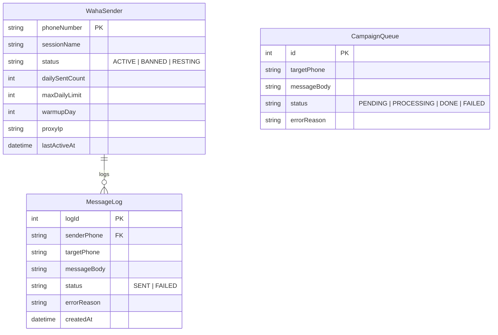

# تحليل شامل لنظام إدارة وحماية حسابات واتساب (WhatsApp Proxy Dashboard)

هذا المستند يقدم تحليلاً شاملاً وعميقاً للنظام البرمجي الحالي لوكيل واتساب (waha-proxy) المبني باستخدام **Next.js 16** و **Prisma (SQLite)** و **TailwindCSS v4**، بالتكامل مع محرك **WAHA (WhatsApp HTTP API)** المدار عبر حاويات Docker ووكيل إنترنت محمول (Mobile Proxy).

---

## 🛠️ نظرة عامة على النظام وأهدافه الرئيسية

الهدف الأساسي من هذا المشروع هو **إرسال رسائل جماعية وحملات واتساب بأمان تام مع تقليل احتمالية الحظر (Anti-Ban) إلى أدنى حد ممكن**.

يعتمد النظام على المبادئ التالية لتحقيق هذا الهدف:
1. **توجيه الترافيك عبر شبكة المحمول (Mobile Data/4G)**: بدلاً من استخدام عنوان الـ IP الخاص بمقر العمل أو الخادم، يتم تمرير الطلبات من حاوية WAHA عبر تطبيق Every Proxy على هاتف محمول، وبالتالي يظهر الترافيك لشركة Meta كأنه اتصال طبيعي من شبكة اتصالات خلوية.
2. **محاكاة السلوك البشري الكامل (Human Simulation)**: النظام لا يرسل الرسائل مباشرة بل يمر بمراحل: إظهار أن الرقم يقرأ الرسالة (Seen) -> إظهار حالة الكتابة (Typing) لوقت يتناسب مع طول الرسالة -> إرسال الرسالة -> الانتظار لوقت عشوائي قبل الخطوة التالية.
3. **التحدث المتبادل الذكي (AI Cross-Talk)**: توليد محادثات وهمية بالعامية المصرية الصميمة بين الخطوط النشطة باستخدام الذكاء الاصطناعي (Groq Llama-3.3-70b-versatile) لرفع تقييم الحساب لدى خوارزميات Meta (Trust Score).

---

## 🗂️ هيكلية المجلدات والملفات البرمجية

يتبع المشروع بنية المجلدات الافتراضية لـ Next.js App Router:

| المجلد/الملف | المسار والروابط | الوظيفة والمسؤولية |
| :--- | :--- | :--- |
| **قواعد البيانات** | [schema.prisma](file:///d:/mada/devlopment/waha-proxy/prisma/schema.prisma) | يحدد جداول المرسلون (Senders)، سجل الرسائل (MessageLog)، وجدول انتظار الحملات (CampaignQueue). |
| **مكتبة قواعد البيانات** | [db.ts](file:///d:/mada/devlopment/waha-proxy/app/lib/db.ts) | يحتوي على عمليات الاستعلام، اختيار خطوط الإرسال بنظام Round-Robin، تحديث أعداد الرسائل اليومية وتصنيف الحسابات المحظورة أو المستريحة تلقائياً. |
| **مكتبة WAHA** | [waha.ts](file:///d:/mada/devlopment/waha-proxy/app/lib/waha.ts) | يدير الاتصال بـ API الخاص بـ WAHA، يشمل بدء الجلسات وتأكيد تفعيل البروكسي، إرسال النصوص والرسائل الصوتية وتغيير الحالات (Typing, Recording). |
| **مكتبة الذكاء الاصطناعي** | [gemini.ts](file:///d:/mada/devlopment/waha-proxy/app/lib/gemini.ts) | يولد رسائل بالعامية المصرية الصارمة عبر Groq API مع دعم محاكاة الأخطاء الإملائية البشرية (Realistic Typos) وتصحيحها بـ `*`. |
| **محرك التحدث المتبادل** | [route.ts (Cross-Talk)](file:///d:/mada/devlopment/waha-proxy/app/api/cross-talk/route.ts) | ينفذ السيناريو التفاعلي الكامل بين رقمين نشطين على خادمين وكيلين مختلفين. |
| **عامل التشغيل الخلفي** | [route.ts (Worker)](file:///d:/mada/devlopment/waha-proxy/app/api/campaign/worker/route.ts) | يقوم بسحب الرسائل المعلقة من طابور الحملات وإرسالها بمحاكاة السلوك البشري. |
| **واجهة التحكم الرئيسية** | [page.tsx](file:///d:/mada/devlopment/waha-proxy/app/page.tsx) | صفحة الإدارة المبنية بـ React وتضم تبويبات لإحصائيات الإرسال، إدارة الجلسات والأجهزة، طابور الحملات والتحكم بالطيار الآلي (Auto-Pilot). |

---

## 🛡️ تفصيل آليات مكافحة الحظر (Anti-Ban Core)

### 1. وكيل المحمول وفحص الاتصال (Proxy TCP Health Check)
في [waha.ts](file:///d:/mada/devlopment/waha-proxy/app/lib/waha.ts#L272-L297)، تقوم دالة `checkProxyHealth` بإنشاء اتصال TCP سريع (خلال مهلة 4 ثوانٍ) مع الـ Proxy IP الخاص بالمرسل قبل إرسال أي رسالة. 
> [!IMPORTANT]
> هذا الفحص يحمي الخطوط؛ فإذا انقطع اتصال Every Proxy أو Tailscale على الهاتف، يتم تعليق الإرسال فوراً بدلاً من إرسال رسالة تفشل أو تكشف الـ IP الفعلي للخادم الرئيسي.

### 2. محاكاة الكتابة المتغيرة (Adaptive Composing Speed)
تعتمد دالة `calculateTypingTime` في [waha.ts](file:///d:/mada/devlopment/waha-proxy/app/lib/waha.ts#L413-L431) على حساب زمن كتابة طبيعي يتأثر بطول الرسالة مع إدخال معاملات تباين عشوائية:
- سرعة كتابة عشوائية تتراوح بين `50ms` و `150ms` لكل حرف.
- نسبة تباين عشوائي بمقدار `15%` زيادة أو نقصاناً في الإجمالي.
- وقت تفكير وتفاعل عشوائي يتراوح بين `300ms` إلى `1000ms` قبل البدء الفعلي للكتابة.
- يتم تحديد حد أدنى `1s` وحد أقصى `14s` للمحاكاة لتجنب بقاء الرقم معلقاً بوضعية typing لفترات مريبة.

### 3. تناوب الخطوط الذكي (Round-Robin IP Separation)
لتجنب توالي إرسال الرسائل من نفس الهاتف المحمول أو نفس الـ IP، تطبق دالة `getNextRoundRobinSender` في [db.ts](file:///d:/mada/devlopment/waha-proxy/app/lib/db.ts#L127-L151) فلتراً يمنع استخدام خادم وكيل (Proxy IP) يتطابق مع الخادم الوكيل الذي استخدم للرسالة السابقة مباشرة، مما يضمن التناوب الجغرافي المستمر بين الخطوط.

### 4. محاكي التحدث المتبادل (Cross-Talk Engine Workflow)
عند تشغيل الطيار الآلي (Auto-Pilot)، يقوم النظام بـ:
1. اختيار رقمين نشطين مختلفين في الـ Proxy IP.
2. استرجاع آخر 6 رسائل من قاعدة البيانات لتوفير سياق مستمر للمحادثة.
3. استدعاء Llama 70B لتوليد ردود قصيرة بالعامية المصرية (أمثلة: "بقولك ايه صحيح"، "طب تمام يا صاحبي").
4. محاكاة الاستلام والقرأة والرد العشوائي (بما في ذلك إمكانية تشتت الصديق وتأخره في الرد لمدد تصل إلى دقيقتين).

---

## 📊 بنية البيانات ودورة حياة الجلسات

تتفاعل الجداول الثلاثة المعرفة في [schema.prisma](file:///d:/mada/devlopment/waha-proxy/prisma/schema.prisma) بطريقة تضمن حماية الحسابات تلقائياً:

### ⚡ آلية التعطيل التلقائي الذكية (Auto-Rest & Auto-Ban Detection)
في [db.ts](file:///d:/mada/devlopment/waha-proxy/app/lib/db.ts#L237-L295)، عند تسجيل نتيجة الإرسال وتحديداً في حالة الفشل (FAILED):
* **أنماط الحظر (Meta Ban Patterns)**: إذا احتوى الخطأ على كلمات مثل `banned`, `blocked by whatsapp`, `account disabled` يتم فوراً تغيير حالة الخط في الجدول إلى **BANNED** وتستبعده دالة التناوب تلقائياً من طابور الإرسال والحملات.
* **أنماط الجلسة المغلقة (Session Closed)**: إذا احتوى الخطأ على كلمات مثل `session not found`, `session status is not as expected` يتم تغيير حالة الخط إلى **RESTING** (مستريح) ليتدخل المشرف يدوياً ويعيد مسح رمز الـ QR دون خسارة الرقم نهائياً.

---

## 📈 توصيات ومقترحات لتحسين النظام (Roadmap for Production)

لترقية هذا النظام من مرحلة إثبات المفهوم (PoC) إلى نظام تجاري يتحمل كميات إرسال ضخمة لآلاف الطلاب:

1. **الانتقال إلى قاعدة بيانات سحابية (Supabase / PostgreSQL)**:
   * **الوضع الحالي**: استخدام SQLite محلي يحد من عمل عدة خوادم بالتوازي وقد يتسبب في قفل الملف (Database is locked) عند زيادة الترافيك.
   * **الحل**: ربط التطبيق بقاعدة Supabase ومزامنة الجلسات وحالة الأجهزة سحابياً.

2. **دعم تواصل حي بالـ WebSockets أو Server-Sent Events (SSE)**:
   * **الوضع الحالي**: صفحة [page.tsx](file:///d:/mada/devlopment/waha-proxy/app/page.tsx) تستخدم الاقتراع الزمني البسيط (Interval Polling) كل 5 ثوانٍ لجلب التحديثات مما يزيد الضغط على خادم Next.js.
   * **الحل**: تفعيل SSE على خادم Next.js لبث الرسائل والـ QR Code والتغييرات لحظياً للمتصفح.

3. **لوحة متقدمة لإدارة الجلسات وقراءة الـ QR**:
   * إضافة واجهة مخصصة لمسح كود الـ QR للخطوط الجديدة مباشرة من لوحة التحكم بدلاً من الاضطرار لفتح لوحة تحكم WAHA الأساسية المفتوحة محلياً.

4. **نظام إشعارات وقائي (Alerting System)**:
   * ربط النظام بـ Discord Webhook أو Telegram Bot لإرسال تنبيهات فورية للمشرفين في حال تم تصنيف أحد الأرقام كـ **BANNED** أو عند تعطل أحد عناوين الـ Proxy IP.

5. **فترة إحماء الخطوط المبرمجة (Warm-up Schedule)**:
   * تطوير منطق برمجي لجدول `warmupDay` بحيث يتم زيادة الحد اليومي للإرسال (`maxDailyLimit`) تلقائياً وبشكل تدريجي (مثال: يبدأ بـ 5 رسائل في اليوم الأول، ثم 10، ثم 20، وصولاً إلى 50) بدلاً من تركه كقيمة ثابتة.
